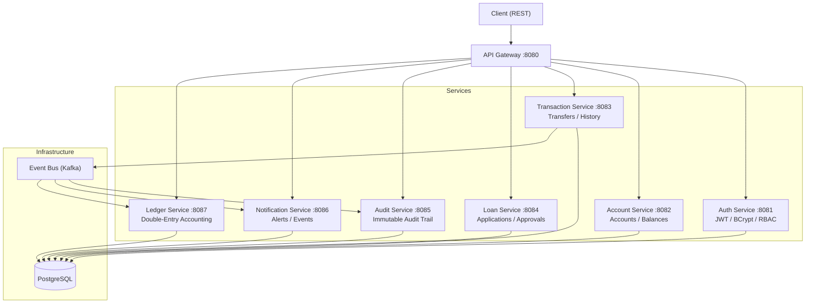

# SmartBank Enterprise Platform

## Overview

A distributed fintech backend system simulating real-world banking infrastructure using Java Spring Boot, microservices, event-driven architecture, and Docker containerization.

---

## Features

- **Secure authentication** — JWT-based with BCrypt password hashing and role-based access control
- **Bank-style transaction processing** — two-phase debit/credit with optimistic locking, idempotency keys, and Kafka-driven reconciler
- **Fraud detection** — rule-based engine evaluating velocity, thresholds, and counterparty patterns asynchronously
- **Audit logging** — immutable append-only log for regulatory compliance with 90-day hot / 7-year cold retention
- **Double-entry ledger** — proper accounting model generating DEBIT/CREDIT pairs for every transfer
- **Event-driven architecture** — Kafka for decoupled consumers (audit, fraud, ledger, notifications)
- **Distributed tracing** — OpenTelemetry across all services for end-to-end observability
- **Containerized deployment** — Docker Compose with one-command startup for all 8 services

---

## Tech Stack

| Layer | Technology |
|-------|-----------|
| Language | Java 21 |
| Framework | Spring Boot 3.4, Spring Security, Spring Data JPA |
| Auth | JWT (jjwt), BCrypt |
| API Routing | Spring Cloud Gateway |
| Database | PostgreSQL (per-service) |
| Event Bus | Apache Kafka |
| Build | Maven (multi-module) |
| Deployment | Docker Compose |
| Monitoring | Spring Boot Actuator |
| Tracing | OpenTelemetry + Zipkin |

---

## Architecture



### System Flow

```
User → API Gateway → Auth Service (JWT validation)
  → Transaction Service (idempotency check)
  → Kafka DebitRequest → Account Service (atomic UPDATE with version lock)
  → Kafka DebitResponse → Transaction Service
  → Kafka CreditRequest → Account Service (atomic credit)
  → Kafka CreditResponse → Transaction Service (COMPLETED)
  → TransferEvent published → Audit / Fraud / Ledger / Notification (async consumers)
```

---

## Microservices

| Service | Port | Responsibility |
|---------|------|---------------|
| **Auth Service** | 8081 | User registration, login, JWT generation, BCrypt hashing, RBAC |
| **Account Service** | 8082 | Account CRUD, balance tracking, atomic debit/credit with optimistic locking |
| **Transaction Service** | 8083 | Transfer orchestration, idempotency, Kafka request/reply flow |
| **Loan Service** | 8084 | Loan applications, interest modeling, approval workflows |
| **Audit Service** | 8085 | Immutable audit log — append-only table, 90-day hot retention |
| **Notification Service** | 8086 | Event-triggered alerts, per-user inbox, read/unread tracking |
| **Ledger Service** | 8087 | Double-entry accounting — DEBIT/CREDIT journal entries |
| **API Gateway** | 8080 | Request routing, JWT validation, rate limiting |

---

## Cloud-Ready Design

This project is designed with cloud deployment principles:

- **Stateless services** — every service runs as a Docker container with no in-memory session state; add replicas behind the Gateway for horizontal scaling
- **Containerized microservices** (Docker Compose) — same configuration deploys locally, in CI, or to any container orchestrator (ECS, Kubernetes)
- **Externalized configuration** via environment variables — no hardcoded secrets or environment-specific values
- **Database-per-service** — each microservice owns its PostgreSQL database for independent scaling
- **Event-driven design** via Kafka — decoupled consumers (audit, fraud, ledger, notifications) scale independently from the critical transfer path
- **Health endpoints** (Actuator) — ready for load balancer health checks and orchestration probes

### Run Locally (Cloud-like Setup)

```bash
# Build all services
mvn clean package -DskipTests

# Start PostgreSQL + Kafka + all services
docker compose up -d
```

---

## API Overview

| Service | Endpoints |
|---------|-----------|
| Auth | `POST /auth/register`, `POST /auth/login` |
| Accounts | `POST /accounts`, `GET /accounts/{id}`, `GET /accounts/user/{userId}`, `PUT /accounts/{id}/balance` |
| Transactions | `POST /transactions/transfer`, `GET /transactions/account/{id}` |
| Loans | `POST /loans`, `GET /loans/{id}`, `POST /loans/{id}/approve`, `GET /loans/user/{userId}` |
| Audit | `POST /audit/logs`, `GET /audit/logs`, `GET /audit/logs/user/{email}` |
| Notifications | `POST /notifications`, `GET /notifications/user/{email}`, `GET /notifications/user/{email}/unread` |
| Ledger | `POST /ledger/entries`, `GET /ledger/accounts/{id}/balance`, `GET /ledger/accounts/{id}/entries` |
| Actuator | `GET /actuator/health`, `GET /actuator/metrics` |

---

## Event Flow

```
Transaction Service
  → publishes DebitRequest → Account Service (atomic debit)
  → publishes CreditRequest → Account Service (atomic credit)
  → publishes TransferEvent (status: COMPLETED)
  → consumed by:
      Audit Service (immutable log)
      Fraud Service (velocity + threshold rules)
      Ledger Service (double-entry journal)
      Notification Service (user alerts)
  
  On credit failure:
  → publishes to reversal-events topic
  → ReversalConsumer checks credit status and reverses debit if needed
```

---

## Security

- Passwords hashed with **BCrypt** (configurable cost factor)
- JWT tokens with 1-hour expiry, signed with HMAC-SHA256
- Authentication enforced at **API Gateway** (JWT validation before routing)
- Authorization enforced at **service layer** (sender must own fromAccount, RBAC for admin endpoints)
- Public endpoints: `/auth/**`, `/actuator/health`
- All other routes require `Authorization: Bearer <token>`

---

## System Design Note

This project demonstrates backend engineering principles critical to financial systems:

- **Data consistency** — optimistic locking with version columns, saga pattern for multi-service operations, Kafka-driven reconciler for eventual correctness
- **Failure resilience** — idempotency keys prevent duplicate execution, circuit breakers prevent cascading failures, compensating transactions handle partial failures
- **Concurrency control** — atomic `UPDATE ... WHERE version = ? AND balance >= ?` serializes balance mutations
- **Scalability** — stateless services, database-per-service, event-driven consumers off the critical path

---

## Environment Variables

Copy `.env.example` to `.env` and configure:

```bash
cp .env.example .env
```

Key variables: `JWT_SECRET`, `DB_URL`, `KAFKA_BOOTSTRAP_SERVERS`, service ports.

---

## Author

**Kirov Dynamics Technology**  
GitHub: [github.com/Raphasha27](https://github.com/Raphasha27)  
Portfolio: [koketso-raphasha.vercel.app](https://portfolio-iota-eight-90.vercel.app)

---

*Designed as a zero-cost, fully-local fintech architecture simulation. No cloud billing required.*
