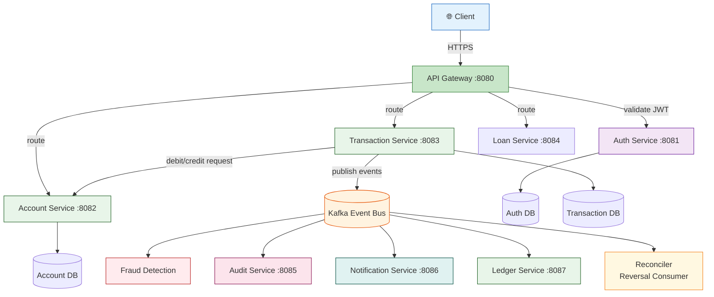
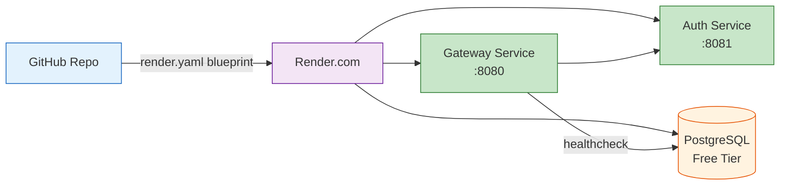

# SmartBank Enterprise Platform

## Overview
SmartBank is a Java Spring Boot-based backend system that simulates real-world banking infrastructure, including secure transactions, account management, fraud detection, and audit logging.

It is designed using a microservices architecture to demonstrate scalability, security, and distributed system design principles.

---

## Core Features

- Secure user authentication (JWT + BCrypt)
- Account balance management
- Money transfer system (ACID transactions)
- Fraud detection service (rule-based monitoring)
- Audit logging for compliance tracking
- Microservices-based architecture
- Dockerized local deployment

---

## Architecture



### Service Mesh

| Service | Port | Responsibility |
|---------|------|---------------|
| API Gateway | 8080 | JWT validation, request routing, rate limiting |
| Auth Service | 8081 | User registration, login, token issuance |
| Account Service | 8082 | Balance management, optimistic locking |
| Transaction Service | 8083 | Transfer orchestration, saga coordinator |
| Loan Service | 8084 | Loan processing, amortization |
| Audit Service | 8085 | Compliance logging, immutable event store |
| Notification Service | 8086 | Email/SMS alerts, event-driven |
| Ledger Service | 8087 | Double-entry accounting, journal entries |

---

## Cloud-Ready Design

This system is designed with production deployment principles:

- Stateless microservices
- Docker containerization
- Environment-based configuration
- Service isolation for independent scaling
- Event-driven architecture for async processing

---

## Transaction Flow (Saga Pattern)

```mermaid
sequenceDiagram
    participant C as Client
    participant GW as API Gateway
    participant TX as Transaction Service
    participant ACC as Account Service
    participant K as Kafka
    participant F as Fraud Service

    C->>+GW: POST /transfer (idempotency-key)
    GW->>GW: validate JWT
    GW->>+TX: forward
    TX->>TX: create PENDING record
    TX->>+K: publish DebitRequest
    K->>-ACC: consume
    ACC->>ACC: atomic debit (optimistic lock)
    ACC-->>K: DebitResponse
    K-->>-TX: response
    TX->>TX: CompletableFuture completes
    TX->>+K: publish CreditRequest
    K->>-ACC: consume
    ACC->>ACC: atomic credit
    ACC-->>K: CreditResponse
    K-->>-TX: response
    TX->>TX: mark COMPLETED
    TX->>+K: publish TransferCompletedEvent
    K->>F: fraud check (async)
    C-->>-C: 200 OK
```

---

## Consistency Model

- Uses ACID database transactions for atomicity
- Optimistic locking (version columns) for concurrency control
- Idempotency keys to prevent duplicate transactions
- Kafka-driven reconciler for saga failure recovery

---

## How to Run

### Local (Docker Compose)

```bash
docker-compose up --build
```

### Cloud Deployment (Render — Free Tier)

[](https://render.com/deploy?repo=https://github.com/Raphasha27/smartbank-enterprise-platform)

Deploy via **one-click blueprint** — no CLI needed, no credit card required. Free tier sleeps after 15min idle, wakes on request, and never expires.

The `render.yaml` blueprint auto-provisions:

```yaml
services:
  - smartbank-gateway   # Docker, port 8080, health-checked
  - smartbank-auth      # Docker, port 8081, health-checked
  - smartbank-db        # PostgreSQL, free tier
```

After deploy:

```bash
curl https://your-service.onrender.com/actuator/health
```

---

## Deployment Architecture


---

## Tech Stack

- Java 21
- Spring Boot 3.4
- Spring Security
- PostgreSQL
- Docker
- Apache Kafka

---

## Author

**Kirov Dynamics Technology**  
GitHub: [github.com/Raphasha27](https://github.com/Raphasha27)
