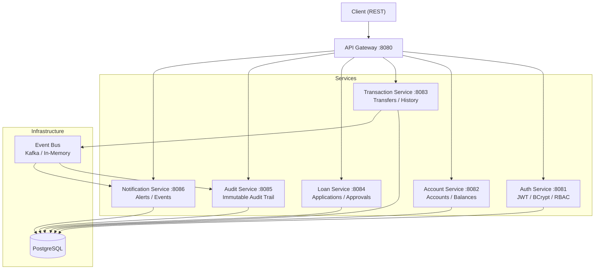

# SmartBank Enterprise Platform

A distributed fintech backend system simulating real-world banking infrastructure using Java Spring Boot and microservices architecture.

---

## Architecture



## System Flow

```
User → Auth Service → Account Service → Transaction Service → Event Bus → Fraud / Audit / Notification Services
```

## Key Features

- Secure authentication (JWT + BCrypt)
- Role-based access control
- Bank-style transaction processing
- Fraud detection rule engine
- Audit logging for compliance tracking
- Microservices architecture
- Dockerized deployment (local environment)

## Tech Stack

| Layer | Technology |
|-------|-----------|
| Language | Java 21 |
| Framework | Spring Boot 3.4, Spring Security, Spring Data JPA |
| Auth | JWT (jjwt), BCrypt |
| API Routing | Spring Cloud Gateway |
| Database | PostgreSQL (per-service) |
| Event Bus | Apache Kafka / In-memory publisher |
| Build | Maven (multi-module) |
| Deployment | Docker Compose |
| Monitoring | Spring Boot Actuator |

## Microservices

| Service | Port | Responsibility |
|---------|------|---------------|
| **Auth Service** | 8081 | User registration, login, JWT generation, BCrypt password hashing, JWT filter enforcement |
| **Account Service** | 8082 | Account CRUD, balance tracking, deposit/withdrawal balance updates |
| **Transaction Service** | 8083 | Money transfers with balance validation, transaction history, event publishing |
| **Loan Service** | 8084 | Loan applications, interest rate modeling, approval workflow |
| **Audit Service** | 8085 | Immutable audit log creation, user action history, queryable trail |
| **Notification Service** | 8086 | Event-triggered alerts, per-user notification inbox, read/unread tracking |
| **API Gateway** | 8080 | Request routing, path-based service distribution |

## Quick Start

```bash
# Build all services
mvn clean package -DskipTests

# Start PostgreSQL + Kafka + all services
docker compose up -d

# Register a user
curl -X POST http://localhost:8080/auth/register \
  -H "Content-Type: application/json" \
  -d '{"name":"Test User","email":"test@bank.com","password":"SecurePass1!"}'

# Login and get token
curl -X POST http://localhost:8080/auth/login \
  -H "Content-Type: application/json" \
  -d '{"email":"test@bank.com","password":"SecurePass1!"}'
```

## API Overview

| Service | Endpoints |
|---------|-----------|
| Auth | `POST /auth/register`, `POST /auth/login` |
| Accounts | `POST /accounts`, `GET /accounts/{id}`, `GET /accounts/user/{userId}`, `PUT /accounts/{id}/balance` |
| Transactions | `POST /transactions/transfer`, `GET /transactions/account/{id}` |
| Loans | `POST /loans`, `GET /loans/{id}`, `POST /loans/{id}/approve`, `GET /loans/user/{userId}` |
| Audit | `POST /audit/logs`, `GET /audit/logs`, `GET /audit/logs/user/{email}` |
| Notifications | `POST /notifications`, `GET /notifications/user/{email}`, `GET /notifications/user/{email}/unread` |
| Actuator | `GET /actuator/health`, `GET /actuator/metrics` |

## Event Flow

```
Transaction Service
  → publishes TransactionEvent
  → consumed by Fraud rules (if amount > 5000 → HIGH_RISK)
  → consumed by Audit Service (persistent log)
  → consumed by Notification Service (user alert)
```

## Security

- Passwords hashed with **BCrypt** (configurable rounds)
- JWT tokens with 1-hour expiry, signed with HMAC-SHA256
- JwtFilter validates every authenticated request
- Public endpoints: `/auth/**`, `/actuator/health`
- All other routes require `Authorization: Bearer <token>`

## Purpose

This project demonstrates backend engineering skills aligned with fintech and banking system design patterns.

## Author

**Kirov Dynamics Technology**  
GitHub: [github.com/Raphasha27](https://github.com/Raphasha27)

---

*Designed as a zero-cost, fully-local fintech architecture simulation. No cloud billing required.*
